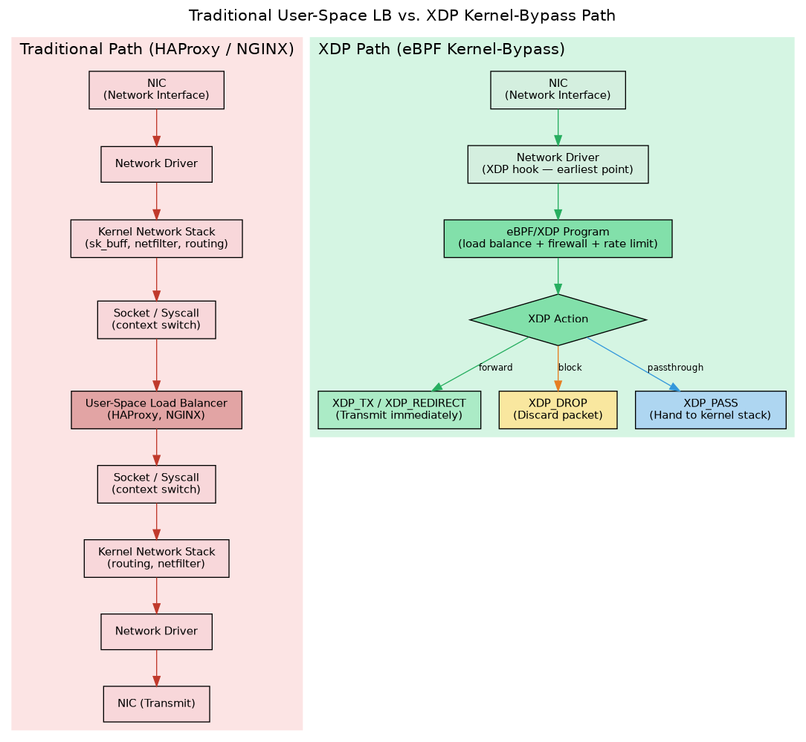
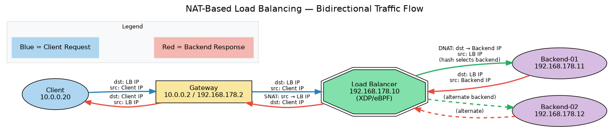
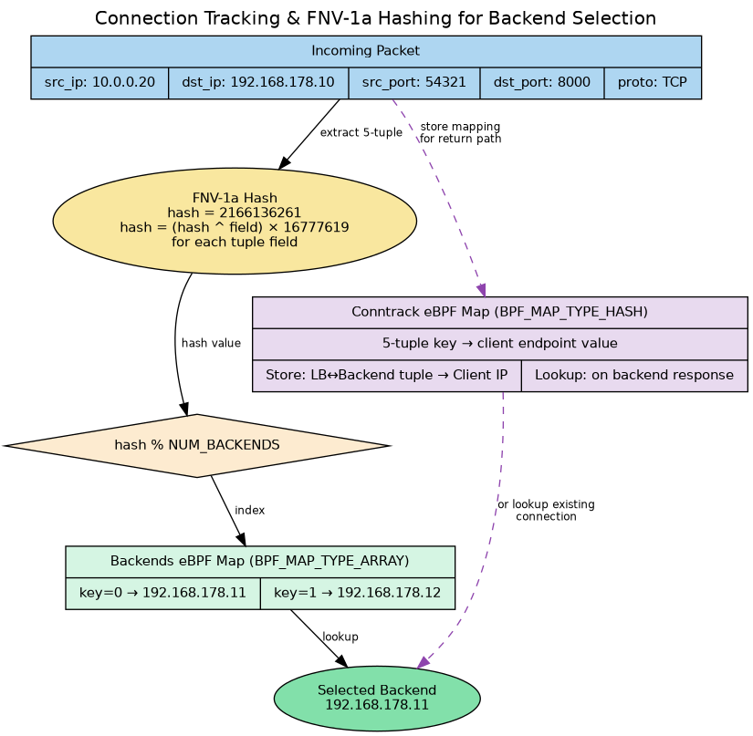
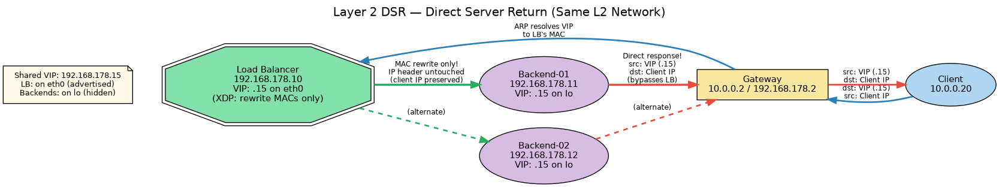
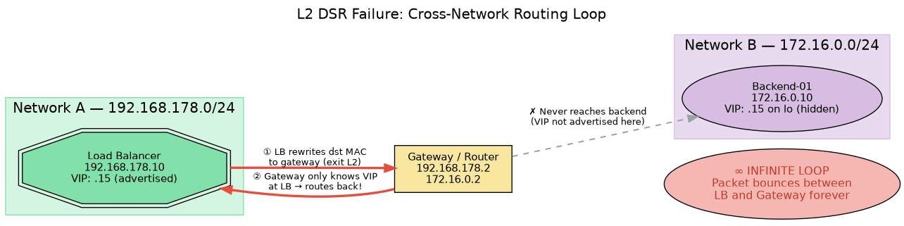
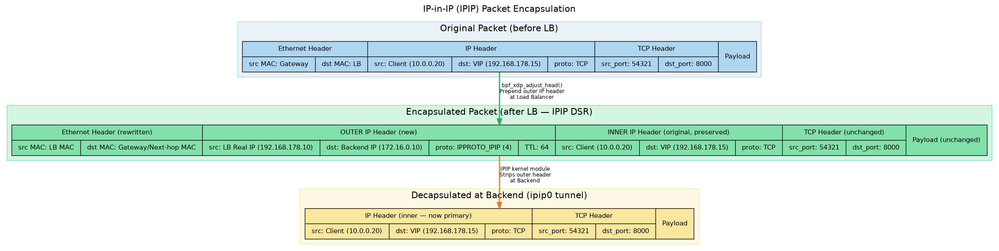
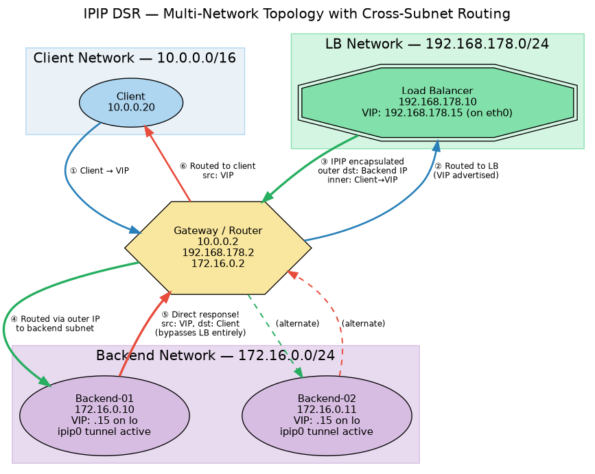
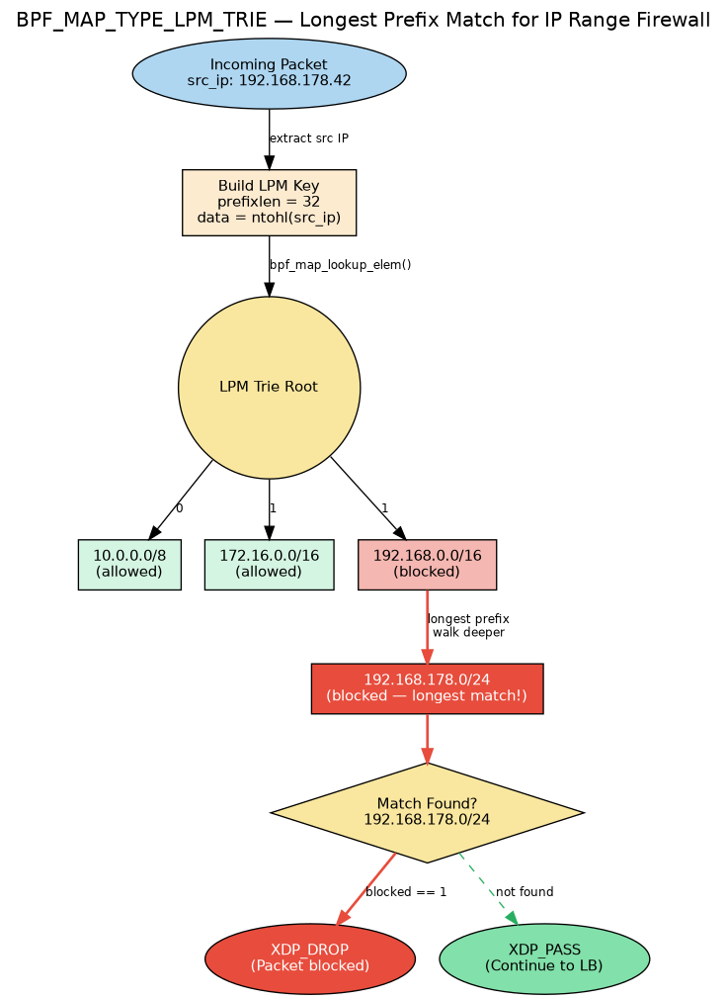
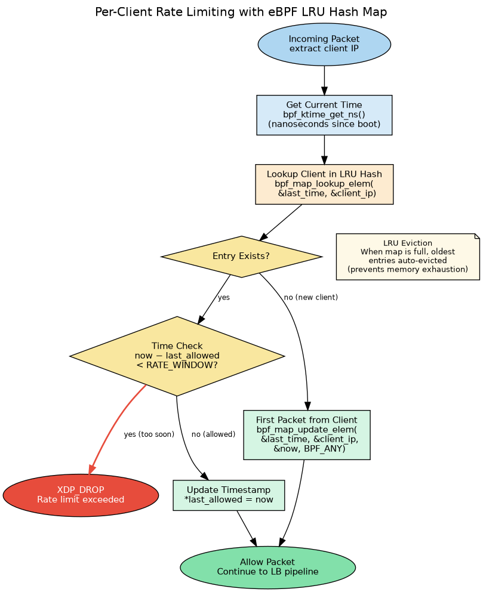
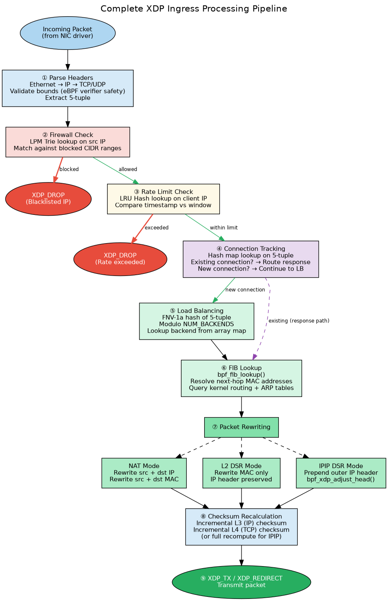

# eBPF/XDP Layer 4 Load Balancer with Integrated Security

**Project Description — High-Performance Kernel-Bypass Load Balancing Solution**

---

## 1. Executive Summary

This document describes the design and architecture of a high-performance Layer 4 load balancer built on eBPF (extended Berkeley Packet Filter) and XDP (eXpress Data Path). The system processes network packets at the earliest programmable point in the Linux networking pipeline — within the network driver itself — bypassing the kernel's networking stack entirely. The project unifies multiple networking capabilities into a single eBPF program: load balancing across three forwarding modes (NAT, Layer 2 Direct Server Return, and IP-in-IP Direct Server Return), integrated firewall functionality with LPM Trie–based CIDR range matching, and per-client rate limiting for abuse mitigation and fair usage enforcement.

The architecture is informed by production systems operating at global scale, including Meta's Katran, Cloudflare's Unimog, and Cilium's eBPF-based networking platform. The implementation distils these proven patterns into a focused, modular solution suitable for both educational reference and practical deployment.

---

## 2. Architectural Foundation

### 2.1 Motivation: Kernel-Bypass Packet Processing

Traditional load balancers such as HAProxy and NGINX operate in user space. Each incoming packet must traverse the network driver, pass through the full kernel networking stack — including allocation of socket buffer structures, netfilter hook evaluations, and routing table lookups — cross the kernel–user boundary via a system call, be processed by the user-space application, and then reverse the entire path before transmission. Every transition introduces latency through context switches, buffer copies, and protocol-layer processing. At packet rates of millions per second, this overhead compounds into a significant performance bottleneck.

XDP fundamentally alters this processing model. An eBPF program attached at the XDP hook executes within the network driver itself, intercepting packets immediately after the NIC delivers them and before any kernel data structures are allocated. The program inspects, modifies, and redirects packets — or drops them — entirely within kernel context. Socket buffers are never allocated, context switches do not occur, and no memory copies are required. The packet path is reduced from a multi-layer traversal through the kernel and back to a single, tight execution loop completing in a few hundred nanoseconds.

*Figure 1: Comparison of the traditional user-space load balancer processing path (left) and the XDP kernel-bypass path (right). The XDP path eliminates all kernel stack traversal and user-space context switching.*

The XDP framework exposes five return codes that determine the disposition of each packet. `XDP_PASS` delivers the packet to the kernel's normal networking stack. `XDP_DROP` silently discards it, which is the mechanism used for firewall blocking and rate limiting. `XDP_ABORTED` discards the packet while firing a tracepoint for diagnostic purposes. `XDP_TX` retransmits the packet back through the same interface on which it arrived, serving as the primary forwarding mechanism for load-balanced traffic. `XDP_REDIRECT` forwards the packet to a different network interface or CPU. The appropriate return code is selected based on the outcome of firewall, rate-limiting, and load-balancing logic, all of which execute within a single eBPF program invocation at wire speed.

### 2.2 eBPF Maps for Persistent State

Network applications require persistent state — connection tables, backend registries, rate counters, and access control lists. eBPF maps provide this functionality as kernel-space data structures accessible from both XDP programs and user-space control-plane applications. Four distinct map types are employed in this project, each selected for the access pattern it serves.

`BPF_MAP_TYPE_ARRAY` stores the backend server endpoint list, indexed by integer key, providing O(1) lookup time. `BPF_MAP_TYPE_HASH` implements the connection tracking table for NAT mode, mapping 5-tuple connection identifiers to their originating client endpoints. `BPF_MAP_TYPE_LRU_HASH` underpins the rate limiter, associating client IP addresses with timestamps and automatically evicting the least-recently-used entries when capacity is reached — a property essential for resilience against source-IP-spoofing attacks. `BPF_MAP_TYPE_LPM_TRIE` powers the firewall's IP range matching, performing longest-prefix-match lookups in O(prefix length) time to determine whether a given source IP falls within any blacklisted CIDR block.

---

## 3. NAT-Based Load Balancing

### 3.1 Operational Principle

Network Address Translation–based load balancing is the most general-purpose forwarding mode. All traffic — both client requests and backend responses — transits through the load balancer, which rewrites IP addresses and MAC headers in both directions. When a client request arrives addressed to the load balancer's IP, the XDP program selects a backend, rewrites the packet's destination IP and MAC to that backend's addresses, and transmits it onward. When the backend's response returns, the load balancer intercepts it, restores the source IP to its own address so the client perceives a reply from the address it originally contacted, rewrites the destination to the original client, and forwards the packet. This bidirectional participation necessitates per-connection state so that each backend response can be correctly associated with its originating client.

*Figure 2: NAT-based load balancing traffic flow. Client requests (blue) pass through the load balancer with destination rewriting (DNAT). Backend responses (red) return through the load balancer with source rewriting (SNAT).*

### 3.2 Connection Tracking

The connection tracking table is implemented as a `BPF_MAP_TYPE_HASH` map. Each TCP connection through the load balancer is uniquely identified by a 5-tuple consisting of source IP, destination IP, source port, destination port, and transport protocol. When processing a new client request, the XDP program stores a mapping from the load-balancer-to-backend 5-tuple to the original client's IP address. When a response subsequently arrives from a backend, the program performs a lookup against this table to determine the client to which the response must be forwarded. Without this state, the load balancer would be unable to correlate backend responses with the clients that initiated them.

On the request path, the program hashes the client's 5-tuple to select a backend, stores the reverse mapping in the conntrack table, rewrites IP and MAC headers, and transmits. On the response path, it retrieves the stored client mapping, rewrites headers to direct the packet to the original client, and transmits. The entire decision and rewrite process completes in a single pass through the XDP program.

*Figure 3: Backend selection via FNV-1a hashing of the 5-tuple, and connection tracking state storage for the return path.*

### 3.3 Session-Affine Hashing

Backend selection employs FNV-1a hashing of the 5-tuple rather than round-robin distribution. The FNV-1a algorithm is computationally inexpensive, compatible with the eBPF instruction set, and produces well-distributed hash values. The resulting hash is reduced modulo the number of backends to yield an index into the backend array map. Because the hash function is deterministic — identical 5-tuples always produce identical hashes — any given client connection is consistently routed to the same backend for its duration. This property, known as session affinity, is essential for stateful applications that maintain server-side session data.

### 3.4 FIB-Based MAC Address Resolution

MAC address resolution is performed dynamically through the kernel's Forwarding Information Base (FIB) and ARP neighbor tables via the `bpf_fib_lookup()` helper function. Given source and destination IP addresses, this helper consults the kernel's routing table to determine the correct egress path and resolves the next-hop MAC address from the neighbor table. The returned structure provides both the source MAC (the load balancer's own interface address) and the destination MAC (the backend directly, or the gateway leading to it). This approach adapts automatically to topology changes and routing updates without requiring any modification to the eBPF program or its configuration.

### 3.5 Trade-offs

NAT mode offers broad applicability: it operates across different subnets, handles gateway routing automatically, and provides the load balancer with full visibility into both request and response traffic for bidirectional policy enforcement. However, processing every packet in both directions imposes double the resource load on the balancer, creating a potential bandwidth bottleneck — particularly for workloads with highly asymmetric traffic patterns, where responses are substantially larger than requests. Additionally, because the load balancer rewrites the source IP on forwarded requests, backend servers observe all traffic as originating from the load balancer's address rather than the actual client. This obscures client identity and prevents IP-based logging, personalization, or per-client security enforcement at the backend layer.

---

## 4. Layer 2 Direct Server Return (L2 DSR)

### 4.1 Overview

Direct Server Return addresses the principal limitations of NAT-based load balancing by removing the load balancer from the response path entirely. Backend servers respond directly to clients, bypassing the load balancer on the return path. The load balancer participates only in the inbound request path, while outbound responses travel directly from backend to client. This architecture dramatically reduces load balancer resource consumption and eliminates it as a bandwidth constraint on the response path — a significant advantage for workloads where a small inbound request triggers a large outbound response, such as video delivery, large API payloads, or AI model inference outputs.

*Figure 4: L2 DSR traffic flow. Client requests (blue) are forwarded through the load balancer via MAC rewriting. Backend responses (red) are sent directly to the client, bypassing the load balancer entirely.*

### 4.2 Virtual IP Architecture

DSR requires that the client perceive all communication as occurring with a single IP address. If a client contacts the Virtual IP (VIP) but receives a response from a different address, the client's TCP stack will reject the packet. To maintain this consistency, both the load balancer and all backend nodes share the VIP. The load balancer advertises the VIP on its primary network interface, ensuring all client-directed traffic reaches it. Each backend also has the VIP configured, but on its loopback interface, which prevents the address from being advertised to the network via ARP. Consequently, no other node on the network is aware the backends possess the VIP, and all client traffic is guaranteed to arrive at the load balancer first.

When a backend sends a response, it uses the VIP as its source address — a valid configuration since the VIP is assigned to the loopback interface — and the client sees the response as originating from the same address it initially contacted. To ensure backends never inadvertently advertise the VIP through ARP, two kernel parameters are configured on each backend: `arp_ignore` is set to respond only to ARP requests targeting IPs on the receiving interface, and `arp_announce` is set to use only addresses assigned to the outgoing interface in ARP requests. These settings guarantee the VIP remains invisible to the broader network.

### 4.3 MAC-Only Packet Rewriting

The defining characteristic of L2 DSR is that only Ethernet-layer MAC addresses are rewritten; the IP header remains entirely untouched. The XDP program on the load balancer sets the source MAC to its own interface address and the destination MAC to the selected backend's address, resolved via the FIB lookup helper. The IP source and destination fields remain exactly as the client set them: source is the client's real IP, destination is the VIP. When the backend receives this packet, it recognizes the VIP as a local address (configured on loopback) and sees the original client IP as the source. It processes the request and responds directly to the client, using the VIP as its source address.

This approach eliminates the need for connection tracking state on the load balancer, since the backend has all the information necessary to respond directly. L2 DSR is therefore both simpler in implementation and more resource-efficient than NAT mode.

### 4.4 Limitations

The fundamental constraint of L2 DSR is that it operates strictly at Layer 2 of the OSI model. Because only MAC addresses are rewritten — not IP addresses — the backend must be reachable via direct L2 adjacency (the same broadcast domain or subnet) from the load balancer. If a backend resides on a different subnet, the MAC rewrite directs the packet to the gateway's MAC address. The gateway then inspects the destination IP (still the VIP), consults its routing table, and determines that the only node advertising the VIP is the load balancer. It therefore routes the packet back to the load balancer, creating an infinite routing loop. This constraint renders L2 DSR unsuitable for cloud deployments, multi-datacenter architectures, or any topology where backends and the load balancer do not share a common Layer 2 network segment.

*Figure 5: The routing loop that occurs when L2 DSR is attempted across different subnets. The gateway, knowing only that the VIP belongs to the load balancer, routes the packet back, creating an infinite loop.*

---

## 5. IP-in-IP Direct Server Return (IPIP DSR)

### 5.1 Cross-Network DSR via Encapsulation

IP-in-IP DSR resolves the cross-network limitation of L2 DSR through packet encapsulation. Rather than rewriting MAC addresses and relying on L2 adjacency, the load balancer encapsulates the entire original packet — including the client's source IP, the VIP destination, TCP header, and payload — inside a new outer IP header. The outer header's source address is the load balancer's real, routable IP, and its destination is the backend's real, routable IP. Standard IP routing carries this encapsulated packet across any number of subnet boundaries and gateway hops. Upon arrival at the backend, the outer header is stripped, revealing the original inner packet exactly as the client sent it. The backend processes the request using the inner header's client source IP and VIP destination, and responds directly to the client using the VIP — exactly as in L2 DSR, but without any requirement for L2 adjacency between the load balancer and backends.

*Figure 6: Packet structure at each stage of IPIP DSR. The original packet (top) is encapsulated with a new outer IP header at the load balancer (middle), then decapsulated at the backend (bottom), restoring the original client-addressed packet.*

### 5.2 Encapsulation Mechanism

The encapsulation process within the XDP program begins by expanding the packet buffer to accommodate a new 20-byte IPv4 header, using the `bpf_xdp_adjust_head()` helper. All data pointers are then recomputed, as required by the eBPF verifier for safety. The outer IP header is constructed with the following key fields: IPv4 version, a header length of 20 bytes (no options), a TTL of 64, and the protocol field set to `IPPROTO_IPIP` (protocol number 4), which signals to the receiving host that the payload is itself a complete IP packet. The outer source address is set to the load balancer's real IP, and the outer destination to the selected backend's real IP. A fresh IP checksum is computed over the outer header. The inner IP header, carrying the client's source IP and the VIP as destination, remains completely unmodified. Ethernet-layer MAC addresses are rewritten using values obtained from the FIB lookup helper, and the packet is transmitted.

### 5.3 Backend Decapsulation

On the backend side, IPIP-encapsulated packets are handled by the kernel's `ipip` module. When this module is loaded and a tunnel interface is configured, the kernel recognizes incoming packets with IP protocol number 4, strips the outer header, and delivers the inner packet to the networking stack for normal processing. The backend sees the original client→VIP addressing, recognizes the VIP on its loopback interface, and processes the request. The response is sent directly to the client using the VIP as the source address, following the same direct-return path as in L2 DSR. The same VIP configuration and ARP suppression settings described in the L2 DSR section apply to IPIP DSR backends.

### 5.4 Multi-Network Deployment Topology

IPIP DSR is designed for deployment topologies where the load balancer, backends, and clients reside on separate network segments. In a representative configuration, the load balancer occupies one subnet, the backend pool occupies another, and client traffic originates from a third, with a gateway providing routing between all segments. Client traffic reaches the VIP on the load balancer's network, the load balancer encapsulates and forwards to a backend on a different subnet via the gateway, and the backend decapsulates, processes the request, and responds directly to the client through the gateway — without the load balancer in the return path. This network isolation improves fault containment and aligns naturally with cloud infrastructure patterns where availability zones correspond to distinct subnets.

*Figure 7: Multi-network IPIP DSR topology. The load balancer, backends, and client each reside on separate subnets. Encapsulated request traffic (green) traverses the gateway using routable outer IP addresses, while direct responses (red) bypass the load balancer entirely.*

---

## 6. Integrated Firewall

### 6.1 XDP-Layer Packet Filtering

Integrating firewall functionality at the XDP layer provides a critical security advantage: malicious packets are discarded at the earliest programmable point in the networking stack, before any kernel resources are allocated. This is particularly important for volumetric DDoS mitigation, where the objective is to drop as many attack packets as possible with minimal CPU expenditure. Benchmarks reproduced from Cloudflare's public testing demonstrate that XDP in native driver mode can sustain drop rates exceeding 10 million packets per second — approximately five times the throughput achievable with iptables raw-table rules and three times that of nftables ingress hooks. At the scale of multi-terabit DDoS floods, this performance differential determines whether the infrastructure survives the attack or is overwhelmed.

### 6.2 Longest Prefix Match with LPM Trie

Effective firewall policy requires the ability to block entire IP ranges rather than individual addresses — a /24 subnet associated with a known threat actor, a /16 block belonging to a hostile network, or an entire cloud provider's address allocation. Enumerating every individual IP within these ranges in a hash map would be both memory-prohibitive and operationally impractical. The `BPF_MAP_TYPE_LPM_TRIE` eBPF map type addresses this requirement through longest-prefix-match lookups, employing the same algorithmic approach used by IP routers for destination-based forwarding decisions.

Each key in the trie consists of a prefix length and the associated IP address data. A single entry with a /24 prefix covers all 256 addresses within that subnet. When the XDP program extracts a client's source IP and queries the trie with a /32 (exact-match) prefix, the trie traverses from root to the longest (most specific) matching prefix. If a match is found at any prefix length, the packet is dropped; if no match exists, the packet proceeds to the load balancing pipeline. This provides O(prefix_length) lookup complexity — fully compatible with wire-speed operation — while allowing the control plane to manage policy at the CIDR block granularity.

*Figure 8: The LPM Trie structure used for firewall IP range matching. An incoming source IP is tested against stored CIDR blocks, with the longest matching prefix determining whether the packet is dropped or allowed.*

### 6.3 Pipeline Placement

The firewall check occupies the first decision point in the processing pipeline, immediately after header parsing. Before any connection tracking, rate limiting, or load balancing logic executes, the source IP is tested against the LPM trie. If a match is found, the packet is immediately discarded via `XDP_DROP`. This early-exit placement ensures that blocked traffic consumes the absolute minimum of processing resources, and that no state is created for connections that will never be serviced. The set of blocked CIDR ranges is populated and managed from the user-space control plane, which converts CIDR notation into the prefix-length and address-data format expected by the LPM trie map.

---

## 7. Rate Limiting

### 7.1 Architecture

Traffic that passes firewall inspection may still require throttling — to enforce API usage tiers, mitigate low-and-slow attacks that evade volumetric detection, or ensure equitable resource allocation among clients. The rate limiter is implemented using a `BPF_MAP_TYPE_LRU_HASH` map that associates each client IP address with the nanosecond-precision timestamp of its most recently allowed packet. The LRU eviction policy is a deliberate design choice: when the map reaches its configured capacity, the oldest entries are automatically discarded, preventing an attacker from exhausting map storage by flooding the system with packets from millions of spoofed source addresses.

*Figure 9: The rate-limiting decision flow. Each incoming packet triggers a timestamp lookup; packets arriving within the rate window are dropped, while those outside the window are allowed and their timestamp updated.*

### 7.2 Timestamp-Based Enforcement

The enforcement mechanism operates on a fixed-window model. When a packet arrives, the program retrieves the current time in nanoseconds (via the `bpf_ktime_get_ns()` helper) and looks up the client's IP in the LRU hash. If an entry exists and the elapsed time since the last allowed packet is less than the configured rate window, the packet is dropped. If sufficient time has elapsed, the timestamp is updated in place and the packet proceeds through the pipeline. If no entry exists — indicating a previously unseen client — the current timestamp is stored and the packet is allowed. This approach is computationally minimal, deterministic, and imposes negligible overhead on the critical path.

### 7.3 Protocol-Aware Considerations

Rate limiting in the context of TCP traffic requires careful application. Indiscriminate per-packet throttling would disrupt TCP handshakes, causing new connections to fail before meaningful data exchange occurs. In practice, rate limiting is most appropriately applied to stateless protocols (ICMP, UDP) or at the connection-establishment phase (TCP SYN) to throttle the rate of new connections. Once a client has exceeded its limit, subsequent SYN packets are also dropped to prevent the continuous creation of connections that would be immediately throttled. This design allows admitted TCP sessions to proceed at full throughput while constraining the rate of new session establishment.

---

## 8. Ingress Processing Pipeline

All packet processing stages execute within a single XDP program invocation, forming a sequential pipeline of nine stages. The pipeline begins with protocol header parsing: Ethernet, IP, and TCP/UDP headers are validated against packet boundaries — a requirement imposed by the eBPF verifier for memory safety — and the connection 5-tuple is extracted. The firewall stage follows, testing the source IP against the LPM trie of blocked CIDR ranges; any match triggers an immediate drop. Packets surviving the firewall enter the rate limiter, which evaluates per-client request frequency against the configured threshold.

Packets that pass both security checks enter the connection tracking stage. A lookup against the conntrack hash map determines whether the packet belongs to an existing connection — indicating a backend response requiring forwarding to the original client — or represents a new client request requiring backend selection. For new requests, the load balancing stage hashes the 5-tuple and selects a backend from the array map. A FIB lookup then resolves next-hop MAC addresses from the kernel's routing and neighbor tables.

The packet rewriting stage applies the transformation appropriate to the configured forwarding mode: NAT mode rewrites both IP and MAC headers; L2 DSR rewrites only MAC headers; IPIP DSR prepends a new outer IP header via buffer expansion. Checksums are recalculated — incrementally for NAT and L2 DSR modes, and fully recomputed for the outer header in IPIP mode. The packet is then transmitted via `XDP_TX`.

*Figure 10: The nine-stage ingress processing pipeline. Packets flow through header parsing, firewall check, rate limiting, connection tracking, backend selection, FIB lookup, packet rewriting, checksum recalculation, and transmission. Drop paths exit the pipeline at the firewall and rate-limiting stages.*

---

## 9. System Requirements and Deployment

### 9.1 Platform Requirements

The system requires Linux kernel version 4.8 or newer for basic XDP support, with kernel 5.x or later recommended for the complete feature set, including the `bpf_fib_lookup` helper, the `bpf_xdp_adjust_head` function for IPIP encapsulation, and full LPM trie map support. The network interface driver must support native XDP for optimal performance; generic (SKB-based) XDP mode is available as a fallback but sacrifices a substantial portion of the performance advantage. The eBPF programs are compiled from C using the clang/LLVM toolchain with libbpf, and the user-space control plane is implemented in Go using the `cilium/ebpf` library for program loading and map management.

### 9.2 Operational Configuration

The load balancer node requires IP forwarding to be enabled at the kernel level so that packets can be routed between interfaces. The ARP neighbor table must contain entries for all backend nodes, as the `bpf_fib_lookup` helper depends on valid ARP data for MAC address resolution. In production environments, continuous health checks against backends maintain these entries automatically.

For DSR modes, the Virtual IP must be configured on both the load balancer's primary interface and on the loopback interface of all backend nodes, with ARP suppression enabled on backends to prevent VIP advertisement. For IPIP DSR, the kernel's `ipip` module must be loaded and a tunnel interface must be created on each backend to handle decapsulation of encapsulated packets. The user-space control plane accepts runtime parameters specifying the network interface, backend IP addresses, blocked CIDR ranges for the firewall, and the load balancer's own IP address for IPIP mode.

### 9.3 Production Readiness Considerations

A production-grade deployment would extend this architecture in several dimensions. Backend health monitoring should continuously probe backend availability and dynamically update the backends eBPF map to remove failed nodes and reintroduce recovered ones. Observability infrastructure should export eBPF map statistics — including active connection counts, firewall drop rates, and rate-limit enforcement counts — to monitoring platforms such as Prometheus. Connection draining logic should permit existing sessions to complete gracefully when a backend is removed from the pool. Hot reloading of the eBPF program should be supported through atomic replacement to ensure zero traffic disruption during updates. The conntrack map should implement TTL-based entry expiration to reclaim resources from closed or timed-out connections.

---

## 10. Performance Characteristics

XDP-based load balancing delivers performance improvements measured in orders of magnitude rather than incremental percentages. In native driver mode, XDP adds approximately 200–500 nanoseconds of latency per packet, compared to 5–20 microseconds for the kernel network stack alone and 50–200 microseconds for a full round-trip through a conventional user-space load balancer. This translates to sustained packet processing rates of 10–20 million packets per second per CPU core, with the potential to achieve line-rate forwarding on modern 10–100 Gbps network interfaces. The firewall component, by discarding packets at the XDP layer before any kernel buffer allocation occurs, can sustain drop rates substantially exceeding those achievable by iptables or nftables — a critical capability for absorbing volumetric DDoS attacks at multi-terabit scale.

The primary scaling constraint in this architecture is the cost of eBPF map operations for connection tracking. Hash map lookups and insertions in the conntrack table represent the most computationally intensive operations in the pipeline. For workloads characterized by very high connection-establishment rates, the conntrack map's capacity and the hash function's collision characteristics become the dominant performance factors. DSR modes, which eliminate connection tracking entirely, exhibit superior scaling behavior under such conditions.

---

## 11. References

### Source Tutorials

- Building an eBPF/XDP NAT-Based Layer 4 Load Balancer from Scratch — [labs.iximiuz.com](https://labs.iximiuz.com/tutorials/xdp-load-balancer-700a1d74)
- Building an eBPF/XDP L2 Direct Server Return Load Balancer from Scratch — [labs.iximiuz.com](https://labs.iximiuz.com/tutorials/xdp-dsr-layer2-lb-92b02f3e)
- Building an eBPF/XDP IP-in-IP Direct Server Return Load Balancer from Scratch — [labs.iximiuz.com](https://labs.iximiuz.com/tutorials/xdp-dsr-load-balancer-b701a95a)
- Building an eBPF-based Firewall with LPM Trie–Based IP Range Matching — [labs.iximiuz.com](https://labs.iximiuz.com/tutorials/ebpf-firewall-ed03d648)
- Network Traffic Rate Limiting with eBPF/XDP — [labs.iximiuz.com](https://labs.iximiuz.com/tutorials/ebpf-ratelimiting-dbc12915)

### Production Reference Systems

- Meta Katran — XDP-based Layer 4 load balancer ([github.com/facebookincubator/katran](https://github.com/facebookincubator/katran))
- Cilium — eBPF-based networking, security, and load balancing ([cilium.io](https://cilium.io/use-cases/load-balancer/))
- Cloudflare Magic Firewall and Unimog — XDP-based DDoS mitigation and global load balancing

### Technical Documentation

- eBPF Documentation — [docs.ebpf.io](https://docs.ebpf.io/)
- XDP Tutorial — [github.com/xdp-project/xdp-tutorial](https://github.com/xdp-project/xdp-tutorial)
- cilium/ebpf Go Library — [github.com/cilium/ebpf](https://github.com/cilium/ebpf)
